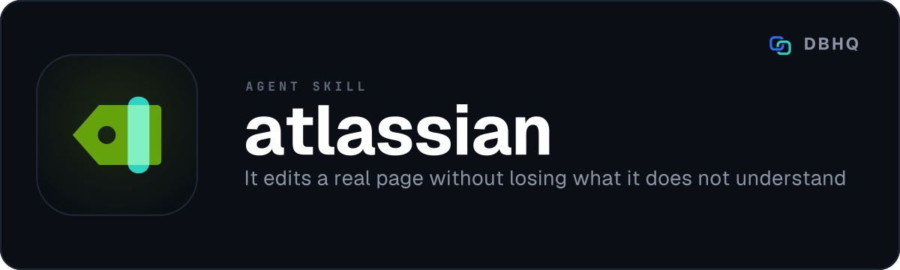

<div align="center">



# atlassian

**Raise the ticket and write the page, without leaving the conversation**

[](LICENSE)
[](https://code.claude.com/docs/en/plugins)
[]()

A free, open-source tool by [DBHQ](https://dbhq.uk) - documented at [skills.dbhq.uk](https://skills.dbhq.uk/atlassian/)

</div>

---

One agent skill for Atlassian Cloud, on one credential and with no MCP server.
It does three jobs:

- **Jira**: creates and reads Jira Cloud issues over the REST API v3. Ask your
  agent to raise a ticket and it does, after checking the project key, the
  issue type and the required fields against your Jira first, so the create
  call is right the first time.
- **Confluence**: searches, reads, creates and updates Confluence Cloud pages
  over the v2 REST API - with a stale-write guard on every update.
- **Publish**: turns a repository's markdown file into a Confluence page,
  idempotently, with the page id written back into the file's own frontmatter.

The skill's `SKILL.md` is short. It holds the setup and the rules, and sends
the agent to the reference for the job in hand: `references/jira.md`,
`references/confluence.md` or `references/publish.md`.

**It creates, reads and updates only.** There is no delete anywhere, no bulk
transition, and no project or space administration. Anything destructive stays
a human job in the Atlassian UI.

## Install

### As a Claude Code plugin (recommended)

```
/plugin marketplace add dbhq-uk/marketplace
/plugin install atlassian@dbhq
```

### Any agent (Cursor, Copilot, Windsurf, Gemini, Cline and more)

```bash
npx skills add dbhq-uk/atlassian-skill
```

The [skills.sh](https://skills.sh) CLI installs into whichever agent directories
it finds, so this works outside Claude Code and Codex too. It copies the one
`skills/atlassian` folder, which carries every script and reference the skill
uses.

### Local install (Claude Code or Codex)

```bash
git clone https://github.com/dbhq-uk/atlassian-skill.git
cd atlassian-skill
./install.sh          # Claude Code: symlinks into ~/.claude/skills (edits are live)
./install-codex.sh    # Codex: installs into ~/.codex/skills
```

[`install.sh`](install.sh) and [`install-codex.sh`](install-codex.sh) are the
same install two ways: Claude Code substitutes `${CLAUDE_SKILL_DIR}`, so the
whole skill directory is symlinked untouched, while Codex does not, so its
`SKILL.md` is rewritten at install time. Re-run the Codex one after editing
`SKILL.md`.

### Upgrading from the three-skill layout

Until 25 September 2026 this repository installed three skills - `jira`,
`confluence` and `confluence-publish` - and a `_shared` folder. They are one
skill now, `atlassian`. Your credential in `~/.dbhq/atlassian` does not move.

- **Plugin install:** update the plugin. Nothing else to do.
- **Local install:** pull, then re-run `./install.sh` or `./install-codex.sh`.
  Each removes what it installed for the old layout, and leaves alone any
  `jira` or `confluence` folder it did not make.
- **`npx skills add`:** that install never worked with the old layout. Remove
  the `jira`, `confluence` and `confluence-publish` folders it left, then run
  it again.

### Requirements

`jq`, `curl`, `column` (the discovery commands' table output - `bsdextrautils`
on Debian/Ubuntu, `util-linux` elsewhere; not guaranteed present), Python 3
(standard library only - nothing to install), and an Atlassian Cloud account
you can create an API token on.


## Setup

One credential serves Jira and Confluence alike, because both on the same site
take the same site URL, the same account email and the same API token:

```bash
<skill-folder>/scripts/atlassian-setup.sh
```

Run it in your own terminal, not through the agent: it asks for the token with
the input hidden. The skill folder depends on how you installed it:

| Install | Setup script |
|---|---|
| Plugin | `~/.claude/plugins/cache/dbhq/atlassian/<commit>/skills/atlassian/scripts/atlassian-setup.sh` - `<commit>` changes with every update |
| `npx skills add` | `<skill-folder>/scripts/atlassian-setup.sh`, where `<skill-folder>` is the `atlassian` folder it installed |
| `./install.sh` | `~/.claude/skills/atlassian/scripts/atlassian-setup.sh` |
| `./install-codex.sh` | `~/.codex/skills/atlassian/scripts/atlassian-setup.sh` |

You do not need to work it out. With no credential, every script prints the
full path to run, and the skill tells the agent to hand you that path.

It asks for three things: your site URL (`https://you.atlassian.net`), the email
on your Atlassian account, and an API token from
<https://id.atlassian.com/manage-profile/security/api-tokens>. The token input is
hidden.

For a script, give the site and the email as options and the token on stdin. It
is read from stdin, never from an argument, so it stays out of `ps`:

```bash
atlassian-setup.sh --site https://you.atlassian.net --email you@example.com < token-file
```

An existing credential is replaced only with `--overwrite`, and only once the
new one verifies.

Setup verifies Jira access against `/rest/api/3/myself` **before** writing
anything, so a wrong token costs you nothing, then checks Confluence access too -
a warning, not a blocker, because a token can be valid for Jira with no
Confluence licence. Credentials are saved to `~/.dbhq/atlassian/config.json` at
mode 600, outside any repository.

Setup takes a classic API token or a scoped one (Create API token with scopes),
and works out which. A scoped token calls `api.atlassian.com` rather than your
site, and with granular scopes and no `delete:` scope it cannot delete anything
even if a script tried. [`SECURITY.md`](SECURITY.md#scope-of-the-token) lists
the scopes. Every API token expires after at most a year; a 401 says so.

The token never reaches a command line, including the multipart request the
attachment upload builds by hand. `curl` reads it from a 0600 config file, so it
does not appear in `ps` output or in shell history.

## Why there is no MCP server here

Confluence Cloud v2 accepts exactly two body representations: `storage` XHTML
and `atlas_doc_format`. Markdown was never one, and `wiki` was dropped. So
every Confluence skill we've seen published sits on top of the Atlassian MCP
server, which accepts a friendlier HTML dialect and converts it for you.

`htmlplus.py` here does that conversion locally. You author in Confluence
HTML+ - panels, status lozenges, task lists, decision lists, expands, layouts,
column widths - and it emits the ADF the REST API takes. No MCP server, no
vendor CLI, no network round trip to convert anything.

It also validates, rejecting invalid nesting before anything is sent, naming
the element. The nesting rules come from Atlassian's own published ADF schema,
which ships with the skill, and an attribute an element does not take is
refused by name rather than dropped:

    Error: A panel cannot contain a table. Close the panel and put the table
    after it as a sibling.

**That local rejection is not the API's own behaviour handed back early - it
is stricter than the API, deliberately.** Posted against a live site, the
same six malformed documents that trip this local check were accepted by the
REST API five times out of six; the one it did reject came back as a bare
`500` with no usable detail. The API is not the safety net it looks like:
Confluence's own editor silently repairs a structurally invalid document the
next time a person opens it, with nobody told. A clean local error you get
before anything is sent is worth more than a `500` you might get after, or a
silent repair you never see at all.

And because a Jira v3 issue description is ADF too, the same converter
formats a ticket. A ticket with a real warning panel, a syntax-highlighted
code block and a status lozenge, rather than a wall of plain text. Jira's
profile is narrower than Confluence's, so a ticket only takes the nodes
Atlassian lists for Jira - see [`docs/jira-profile.md`](docs/jira-profile.md).

## A known limit: the round-trip gate

`confluence-pages.sh update` refuses to overwrite a page whose current
content this converter cannot read back unchanged - value equality on the
parsed ADF, not a byte-identical comparison. Both documents are normalised
first, so an empty `attrs`, `content` or `marks` and a missing one compare
equal, and so do two adjacent text nodes with the same marks and one node
holding both. A table the converter cannot convert back at all, such as one
with a column width on some cells and not others, is refused the same way,
naming the table. `edit` only checks the block it
replaces, and `publish.sh` does not run the gate at all: it replaces the page
with the file by design, and checks instead that nobody edited the page in
Confluence since the last publish.

`UPDATE REPLACES THE WHOLE BODY`, so writing over content like that would
silently drop whatever does not survive the round trip, not only the part you
meant to change.

**A live-site measurement once found this refusing roughly 60% of a 289-page
sample** - almost always an ordinary
node's own attribute or mark (a local id, a colspanned cell's per-column
widths, a list's start number, the editor's "make this wide" toggle) rather
than an exotic node type. Generalising the carry-through-or-opaque-passthrough
rule that already covered media to every named node type closed that gap,
and the same measurement now passes cleanly.

This is a separate guard from `--base-version`, which `update` also always
requires: `--base-version` refuses a write if the page has moved on since
the version you read, an optimistic-concurrency check unrelated to whether
the content round-trips at all.

The two can refuse the same command for two
different reasons - a stale version, or content this converter cannot carry
through unchanged - and both are named here because this is the section a
refusal on either sends you to.

The usual cause is an earlier direct edit in the Confluence web editor, which
writes a node, an attribute or a mark this converter has no HTML+ form for.

This is not a bug and there is no workaround: **there is no `--force`
anywhere in this skill.** A refusal here means a human resolves it in
the Confluence UI first, not that the skill retries harder.

Two things soften this rather than hide it:

- **Opaque passthrough.** An ADF node type this converter does not recognise
  by name still converts - as an HTML+ element carrying its ADF JSON
  verbatim, which converts straight back unchanged - rather than the whole
  document being refused outright. Before this existed, the converter itself
  refused 35 of 40 real pages sampled from a live site; a *known* type that
  would otherwise drop an attribute it cannot represent degrades the same
  way, to an opaque blob, rather than silently narrowing the page.
- **`edit` narrows the gate to one block.** It converts only your fragment
  and splices it into the live page by local id, so the rest of the page -
  whatever it holds - never goes through the converter.

## Use

Talk to your agent: "raise a bug in PAY about the timeout", "what does the
wiki say about egress addresses", "publish this doc to Confluence". The
scripts are also usable directly.

### Jira

```bash
cd ~/.claude/skills/atlassian/scripts

./jira-meta.sh projects              # project keys you can see
./jira-meta.sh types PAY             # issue type names in that project
./jira-meta.sh fields PAY Task       # what a create accepts, required marked

./jira-issues.sh create PAY Task "Summary" "Description" --label infra --priority High
./jira-issues.sh create PAY Task "Summary" --description-file /tmp/desc.html
./jira-issues.sh create PAY Task "Summary" --field customfield_10050=Ops
./jira-issues.sh bulk PAY tickets.json --dry-run
./jira-issues.sh get PAY-12 --comments 10
./jira-issues.sh search "assignee = currentUser() AND statusCategory != Done"
./jira-issues.sh mine
```

Issue type names are per-project. `Task` in one project may be `Story` or
`Work Item` in another, so read `types` rather than assuming.

`create` takes `--field KEY=VALUE` (repeatable) for anything the built-in
options do not cover - a project-specific required field, or a component
with no default. Read the field id with `jira-meta.sh fields` first.

A
value that parses as JSON is sent as JSON (`--field components='[{"name":"Backend"}]'`);
anything else goes as plain text. In a `bulk` file, an entry takes a `fields`
object for the same purpose, e.g. `"fields": {"customfield_10050": "Ops"}`.

`bulk` takes a JSON array. Only `summary` is required; `type` defaults to
`Task`. **Run it with `--dry-run` first** - that prints the exact payload for
every issue and sends nothing.

A batch pauses a second between creates. On a
429 it waits for `Retry-After` and retries that issue once, following
[Atlassian's rate-limiting guidance](https://developer.atlassian.com/cloud/jira/platform/rate-limiting/),
and stops sending if the limit has not cleared. It reports `Created:` and
`Failed:` counts at the end. A partial failure leaves the created issues in
place, because there is no rollback: the skill cannot delete. Every entry that
was not created goes to a remaining file (`tickets.json` gives
`tickets.remaining.json`), so a re-run of that file sends only those.

```json
[
  {"summary": "Enable the storage provider on the subscription", "type": "Task",
   "description": "Blocks the deployment.\n\nOnly the pipeline identity can do this.",
   "labels": ["infra"], "priority": "High"},
  {"summary": "Add retry handling to the upload step",
   "fields": {"components": [{"name": "Backend"}]}}
]
```

Blank lines in a plain-text description become separate paragraphs. `bulk`
has no `--description-file` equivalent - every description in a bulk file is
plain text.

### Confluence

```bash
cd ~/.claude/skills/atlassian/scripts

./confluence-search.sh spaces
./confluence-search.sh text 'egress address'
./confluence-search.sh cql 'space = DOCS and lastmodified >= now("-7d")'

./confluence-pages.sh read 1234567                              # HTML+
./confluence-pages.sh read 1234567 --format markdown             # to understand it, never to edit
./confluence-pages.sh create --space 98765 --title "Payment Correlation" \
    --parent 1234567 --body-file /tmp/body.html
./confluence-pages.sh edit 1234567 --base-version 14 \
    --replace 5f1c2a9e --body-file /tmp/fragment.html --dry-run
./confluence-pages.sh update 1234567 --body-file /tmp/current.html \
    --base-version 14 --message "Added the egress address"
```

`edit` changes one block and leaves the rest of the page alone. It converts
only your fragment and splices it into the live page by local id - in place
of a block (`--replace`), after it (`--insert-after`) or at the end
(`--append`). Nothing else on the page goes through the converter, so the
round-trip gate only checks the block being replaced. `update` rewrites the
whole body. Both take `--dry-run`, which sends nothing and names every node
the write would remove.

Every `read` prints the page's current version and the exact flag an update
needs: `# page id 1234567, version 14 - pass --base-version 14 to update`. That
line goes to stderr, not stdout, so `read 1234567 > /tmp/current.html` still
shows it on your terminal while the redirect captures a clean fragment - one
you can splice a change into and pass straight to `update --body-file`, with
no header line ahead of it to reject as loose text.

`update` always needs that `--base-version` - see [§ A known limit](#a-known-limit-the-round-trip-gate)
for what it protects against and what it does not.

### Publishing markdown

```bash
cd ~/.claude/skills/atlassian/scripts

./publish.sh docs/payment-correlation.md --dry-run
./publish.sh docs/payment-correlation.md
```

Each file carries its own binding in YAML frontmatter:

```yaml
---
confluence:
  space: "98765"
  parent: "1234567"
  page_id: "8901234"
---
```

`page_id` is written back on the first publish - **commit that change**, or
the next run creates a second page instead of updating the first.

These markdown constructs convert: headings (`#`, or underlined), paragraphs
with hard line breaks, bullet and numbered lists (a numbered list keeps its
start number), GFM task lists (`- [ ]`, which become real Confluence task
lists), tables, blockquotes, fenced code blocks with ```` ``` ```` or `~~~`,
thematic breaks, links and `<https://...>` autolinks, bold, italic,
strikethrough and inline code in either the `*` or `_` form, backslash
escapes, and an image on a line of its own - at an absolute URL, or a local
file, which publish uploads as a page attachment and reuses on later runs
while it is unchanged.

Anything else - an image inside a sentence, a reference-style link or
footnote, an indented code block - is refused by name rather than published as
literal markdown.

Publish replaces the page with the file, so before it writes it checks who
wrote last. Every publish leaves the message `Published from <file>` on its
version. If the latest version is anything else, somebody edited the page in
Confluence, and publish refuses, naming that version, its author and its
date. Bring the edit into the file, then publish with `--base-version` set to
that version to confirm it. A publish that would change nothing sends
nothing, so re-running an unchanged file adds no empty versions.

A panel, a status lozenge, a decision list, a layout and a column width have
no markdown syntax at all - write them as raw HTML+ on its own line, which
markdown permits and this skill passes through untouched.

The same markup
embedded mid-sentence in running prose is not detected as a tag and is
escaped to visible text instead - give an inline component its own line.

**Nested markdown lists are refused, not mangled.** `- one` with a
`  - nested` line indented under it stops the conversion outright, naming the
line, rather than silently splitting into two lists with the marker left as
stray text in the page. Flatten it to a top-level item, or write the nesting
directly in HTML+.

**A relative link to another file is refused, not published pointing
nowhere.** `[guide](guide.md#heading)` cannot be resolved - this converter
reads one file at a time and has no way to know that file's own published
Confluence URL, or whether it has been published at all. Link the absolute
Confluence URL once it exists, or an absolute external URL. An in-page anchor
(`[above](#section)`) and a `mailto:` link both still work.

A fenced code block's language token is accepted as written, punctuation and
all (`` ```c++ ``), not restricted to a plain word.

## Files

| Path | What it is |
|---|---|
| `skills/atlassian/SKILL.md` | What the agent reads first: setup, the rules, and which reference to load |
| `skills/atlassian/references/jira.md` | Creating, reading and searching Jira issues |
| `skills/atlassian/references/confluence.md` | Searching, reading, creating and updating Confluence pages |
| `skills/atlassian/references/publish.md` | Publishing a markdown file to a Confluence page |
| `skills/atlassian/references/house-style.md` | Conventions for writing a page or a description |
| `skills/atlassian/references/html-patterns.md` | Every HTML+ pattern - panels, lozenges, tasks, layouts, tables |
| `skills/atlassian/references/checklist.md` | Pre-publish checklist |
| `skills/atlassian/references/ste.md` | Simplified Technical English, for issue text |
| `skills/atlassian/scripts/atlassian-setup.sh` | Credential capture and verification |
| `skills/atlassian/scripts/_common.sh` | Shared request, error, ADF and credential-migration helpers |
| `skills/atlassian/scripts/htmlplus.py` | The HTML+ <-> ADF converter, the round-trip gate, and opaque passthrough |
| `skills/atlassian/scripts/adf-schema/` | Atlassian's published ADF JSON schema (Apache-2.0), which the converter's nesting check reads |
| `skills/atlassian/scripts/jira-meta.sh` | Projects, issue types, fields, priorities, read-only |
| `skills/atlassian/scripts/jira-issues.sh` | Create, bulk create, get, search |
| `skills/atlassian/scripts/confluence-search.sh` | Spaces, CQL and free-text search |
| `skills/atlassian/scripts/confluence-pages.sh` | Read, create, edit, update - the stale-write and round-trip guards |
| `skills/atlassian/scripts/adf_edit.py` | Splices a fragment into a page by local id, and says what a write would remove |
| `skills/atlassian/scripts/publish.sh` | The dry-run/create/update run, the last-edit check, image upload, and the write-back of `page_id` |
| `skills/atlassian/scripts/_confluence.sh` | Reading and writing one page, shared by `confluence-pages.sh` and `publish.sh` |
| `skills/atlassian/scripts/md_to_htmlplus.py` | Markdown to HTML+, with raw HTML+ passed through |
| `skills/atlassian/scripts/frontmatter.py` | Reads and writes the YAML binding, without `eval` |
| `skills/atlassian/scripts/attachments.sh` | Multipart attachment upload - the token stays off the command line here too |
| `skills/atlassian/tests/` | The converter, publish and repo-wide constraint suites |

## Also from DBHQ

Every DBHQ agent skill is free, open source and installable from the same
marketplace, and all of them are documented at
**[skills.dbhq.uk](https://skills.dbhq.uk)**. The marketplace itself is
[dbhq-uk/marketplace](https://github.com/dbhq-uk/marketplace) - one
`/plugin marketplace add` and every one of them is available.

| Skill | What it does |
|---|---|
| [outlook](https://skills.dbhq.uk/outlook/) | Microsoft 365 mail and calendar, from the terminal |
| [trello](https://skills.dbhq.uk/trello/) | Your boards, run from your agent |
| [legwork](https://skills.dbhq.uk/legwork/) | Research that settles a decision, and says when it cannot |
| [dovetail](https://skills.dbhq.uk/dovetail/) | Checks whether your repository still agrees with itself |
| [verve](https://skills.dbhq.uk/verve/) | Strips AI tells from prose and puts a voice back |
| [vela](https://skills.dbhq.uk/vela/) | Compiler-exact code search, in any language you index |
| [garmin](https://skills.dbhq.uk/garmin/) | Your Garmin data, answered in the terminal |
| [imager](https://skills.dbhq.uk/imager/) | Images from GPT Image 2, costed before it spends |
| [gitview](https://skills.dbhq.uk/gitview/) | Which branches are finished, and safe to delete |
| [heliograph](https://skills.dbhq.uk/heliograph/) | Change a machine you cannot log into, through an operator |
| [pennyblack](https://skills.dbhq.uk/pennyblack/) | A physical letter, posted from the terminal |
| [buildwork](https://skills.dbhq.uk/buildwork/) | Your open issues, run as parallel agents |
| [deskwork](https://skills.dbhq.uk/deskwork/) | What an agent noticed, tracked as real work |
| [groupwork](https://skills.dbhq.uk/groupwork/) | A second agent on the work, adversary or partner |
| [headwork](https://skills.dbhq.uk/headwork/) | One decision at a time, with a recommendation |

Plus [heliograph](https://skills.dbhq.uk/heliograph/), for a machine you cannot log into.

## Licence

MIT. See [LICENSE](LICENSE).
